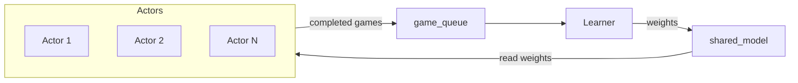

# 八子棋 MuZero：原理说明、算法流程与操作指南

三人八子棋（Eight-in-a-Row）的 MuZero 训练与对弈系统：基于 MuZero + Gumbel 搜索 + DeepSeek MLA 骨干，支持课程学习、联赛、PBT、Engram 记忆与 EfficientZero 一致性损失。

**主要功能**：同步/异步训练、FastAPI AI 对弈服务、WebSocket 训练监控台。

---

## 一、原理说明

### 1.1 游戏与环境

- **棋盘与规则**：棋盘大小为 S×S（如 100×100），三名玩家（1=红、2=绿、3=蓝）轮流落子，先连成 `win_length`（如 8）子者获胜。步奖励：非终局为 0，获胜时为 1（当前玩家）；终局按名次使用 `placement_rewards`（如 1st +1.0、2nd -0.2、3rd -1.0）用于价值目标。
- **状态与动作**：动作空间为局部视野的离散格点，大小为 `local_view_size²`（如 21×21=441），即局部动作索引。观测为**当前玩家视角**的局部视野与全局缩略图（4 通道局部 + 4 通道全局）。详见 [ai/MATH.md](ai/MATH.md)。

### 1.2 MuZero 抽象

- **表示网络**：\( h = \text{representation}(\text{obs}) \)，将观测编码为隐状态。
- **动力学网络**：\( (h', r) = \text{dynamics}(h, a) \)，由当前隐状态与动作预测下一隐状态与即时奖励。
- **预测网络**：\( (\text{policy}, \text{value}) = \text{prediction}(h) \)，输出策略分布与价值。
- **价值语义**：价值为 3 维向量 \((V_{\text{me}}, V_{\text{next}}, V_{\text{prev}})\)，表示在当前状态下三名玩家的期望折扣回报（当前玩家视角），与 n 步 TD 目标一致。

### 1.3 Gumbel MuZero MCTS

与标准 PUCT 的差异：

1. **根节点**：对先验 logits 加 Gumbel(0,1) 噪声，增强探索。
2. **Sequential Halving**：从 top-m 个动作出发，多轮减半候选，用网络评估缩小集合。
3. **策略改进**：改进策略 \( \bar{\sigma} = \text{softmax}(\text{logits} + c_{\text{scale}} \cdot \text{normalized\_Q}) \)，具有单调改进性质。
4. **内部节点**：仍使用标准 PUCT 选择；叶节点批量扩展、虚拟损失、回传。

参考文献：Danihelka et al., "Policy improvement by planning with Gumbel" (2022)。实现见 [ai/mcts.py](ai/mcts.py)。

### 1.4 训练目标

- **价值损失**：n 步 TD 目标（向量），MSE；目标由 `_compute_value_target` 计算，含终局 placement 或 bootstrap 旋转。
- **奖励损失**：步奖励标量，MSE。
- **策略损失**：MCTS 改进策略与网络策略的交叉熵。
- **Consistency（EfficientZero）**：预测隐状态与真实下一观测的表示一致性，SimSiam 式 \( 2 - 2\cdot\cos\text{\_sim} \)。
- **Focus**：聚焦网络（预测落子中心）的辅助损失。

数学细节与约定见 [ai/MATH.md](ai/MATH.md)。

### 1.5 可选模块简述

| 模块 | 说明 |
|------|------|
| **Engram** | 外部情节记忆：存储 (key, value)，检索时通过 cross-attention 增强隐状态，使网络可回忆历史局面模式。 |
| **Curriculum** | 课程学习：分阶段增大棋盘与连子数（如 15×15→30×30→50×50→100×100），按对局数、胜率、损失、可选 Elo 毕业。 |
| **League** | 联赛：历史对手池 + Elo 评分，按概率采样对手进行对局，提升多样性。 |
| **PBT** | 种群基于训练：多智能体种群，周期性复制/变异超参（如学习率、权重衰减）。 |
| **KOTH** | 王座模式：轮流训练“当前玩家”，其余玩家网络冻结，平衡三方强度。 |

---

## 二、算法流程

### 2.1 同步训练 (train.py)

循环每轮：

1. **自对弈**：生成 N 局游戏（`play_game` / `run_selfplay`），使用当前网络与 Gumbel MCTS。
2. **写入 ReplayBuffer**：将每局轨迹（观测、动作、奖励、策略目标、价值目标等）存入 buffer。
3. **采样与训练**：按质量加权采样 batch，执行 `train_step`（设备转移、张量验证、representation → dynamics → prediction、多损失、反向传播与梯度裁剪）。
4. **可选**：按间隔保存 checkpoint、更新 curriculum、联赛对手与 Elo。

### 2.2 异步训练 (train_async.py)

多进程：多个 **Actor** 进程生成对局，一个 **Learner** 进程在 GPU 上训练并定期更新权重。



- **Actor 循环**：(1) 从共享内存或文件加载最新权重；(2) 可选加载 curriculum/league/KOTH 状态；(3) 自对弈一局或多局；(4) 将完成的对局放入 `game_queue`。
- **Learner 循环**：(1) 从 `game_queue` 取游戏；(2) 写入 ReplayBuffer 并做合法性/预计算；(3) 预取下一 batch（pin_memory）；(4) `train_step`；(5) 按间隔 checkpoint、更新 curriculum/league/PBT；(6) 将新权重写回共享内存，供 Actor 读取。

### 2.3 单步 train_step 数据流

1. **前向**：observation → representation →（可选 engram read）→ prediction（policy, value, aux）；session context 可注入隐状态。
2. **Unroll**：对 K 步使用 dynamics + prediction，得到各步价值、奖励、策略。
3. **损失**：value（MSE）+ reward（MSE）+ policy（CE）+ consistency（2−2·cos_sim）+ focus（辅助）。
4. **反向**：梯度缩放（unroll 步 1/K）、梯度裁剪（max_grad_norm）、optimizer.step。

---

## 三、操作使用指南

### 3.1 环境依赖

- **Python**：3.x。
- **依赖安装**（依赖在 `ai/requirements.txt`）：
  ```bash
  pip install -r ai/requirements.txt
  ```
  主要包含：`torch`、`numpy`、`fastapi`、`uvicorn`。
- **可选**：`websockets`（训练监控台）、`psutil`（ReplayBuffer 系统内存紧急驱逐）。

从项目根目录执行上述命令；若将 `ai/requirements.txt` 复制到根目录为 `requirements.txt`，也可使用 `pip install -r requirements.txt`。

### 3.2 同步训练

```bash
python -m ai.train [--steps 1000] [--resume] [--checkpoint-dir checkpoints] [--cpu] [--batch-size 512] [--lr 1e-3] [--selfplay-games 10] [--simulations 100] [--min-buffer 100] [--stage 1|2|3|4] [--board-size N] [--win-length K] [--ws-port 5001]
```

- `--stage`：课程阶段（1=15×15/5 子，2=30×30/6 子，3=50×50/7 子，4=100×100/8 子）。
- `--resume`：从 `checkpoint_dir/latest.pt` 恢复训练与 buffer。
- `--ws-port`：训练监控台 WebSocket 端口，默认 5001。

### 3.3 异步训练

```bash
python -m ai.train_async [--steps 100000] [--actors 8] [--resume] [--min-buffer 100] [--batch-size 512] [--lr 1e-3] [--simulations 100] [--max-memory 35] [--auto-curriculum] [--koth-mode] [--koth-period 10000] [--pbt-pop-size 4] [--checkpoint-interval 500]
```

- 检查点目录默认 **checkpoints_async**；入口会调用 `config.validate()`。
- `--auto-curriculum`：启用自动课程进阶；`--koth-mode`：王座模式；`--pbt-pop-size`：PBT 种群大小。

### 3.4 AI 对弈服务

```bash
python -m ai.server [--model checkpoints/best_model.pt] [--port 5000] [--host 0.0.0.0] [--cpu]
```

- **GET /api/status**：模型是否加载、路径、设备、参数量。
- **POST /api/move**：请求体 `board`（100×100）、`current_player`（1/2/3）、`move_history`；返回落子 `(row, col)`、置信度、思考时间、可选 `root_value` 与 `top_actions`。

### 3.5 训练监控台

- 用浏览器打开项目根目录下的 **train_dashboard.html**，在页面中连接 WebSocket（默认 `ws://localhost:5001`）。
- 同步训练时需保证 `--ws-port 5001`（或与页面中填写的端口一致）；异步训练默认已开启 5001。
- **若无法连接**：先安装 `pip install websockets`；若训练在远程或 WSL 运行，将地址改为 `ws://<主机IP>:5001`。
- 功能：实时自对弈棋盘、累计胜率（红/绿/蓝/平局）、名次分布、训练指标与损失曲线等。

### 3.6 配置与检查点

- **配置**：完整字段与默认值见 [ai/muzero_config.py](ai/muzero_config.py) 中的 `MuZeroConfig`；训练与 server 的入口脚本通过命令行参数覆盖部分字段。
- **检查点**：
  - 同步：`checkpoint_dir`（默认 `checkpoints`）下的 `latest.pt`、`best_model.pt` 等。
  - 异步：`checkpoints_async` 下的 `shared_weights.pt`、`shared_memory.pt`、`latest.pt` 等。
- 规模与上限（buffer、队列、演员数等）见 [ai/SCALABILITY.md](ai/SCALABILITY.md)。

### 3.7 常见参数速查

| 类别 | 参数示例 |
|------|----------|
| 训练 | `steps`, `batch_size`, `learning_rate`, `num_simulations`, `td_steps`, `num_unroll_steps`, `discount` |
| 规模 | `replay_buffer_size`, `max_memory_gb`, `min_buffer_games`, `game_queue_maxsize`, `actors`, `prefetch_workers` |
| 课程/联赛/PBT | `auto_curriculum`, `league_opponent_prob`, `pbt_population_size`, `pbt_period` |

---

## 四、目录与进阶文档

- **根目录**：`train_dashboard.html`（训练监控台）、`README.md`（本文件）、`ai/`（核心实现）。
- **进阶阅读**：
  - [ai/MAINTENANCE.md](ai/MAINTENANCE.md)：各组件维护约束与不可删除项。
  - [ai/MATH.md](ai/MATH.md)：状态/动作/价值/MCTS/训练公式的数学约定。
  - [ai/REUSABILITY.md](ai/REUSABILITY.md)：公共 API 与组件复用方式。
  - [ai/SCALABILITY.md](ai/SCALABILITY.md)：规模相关配置与调参。
  - [ai/EFFICIENCY.md](ai/EFFICIENCY.md)：已有效率措施与保留建议。
